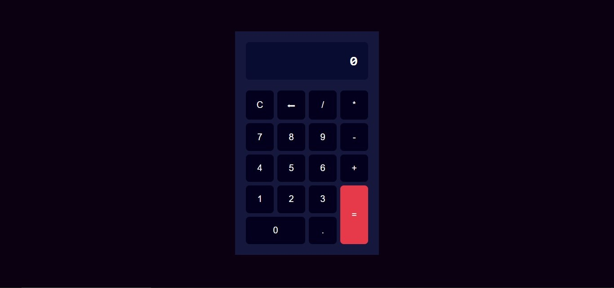

# Calculadora 💻

**Este proyecto consiste en una calculadora basica programada con JavaScript asi como tambien el uso de HTML y CSS.**

**Realiza operaciones basicas como:**
- suma
- resta
- multiplicacion
- divicion

**Este proyecto me sirvio para aplicar mis conocimentos en maquetacion con HTML y aplicar los estilos con CSS grid. **

## Link
**https://leonardo291024.github.io/calculadora/**

